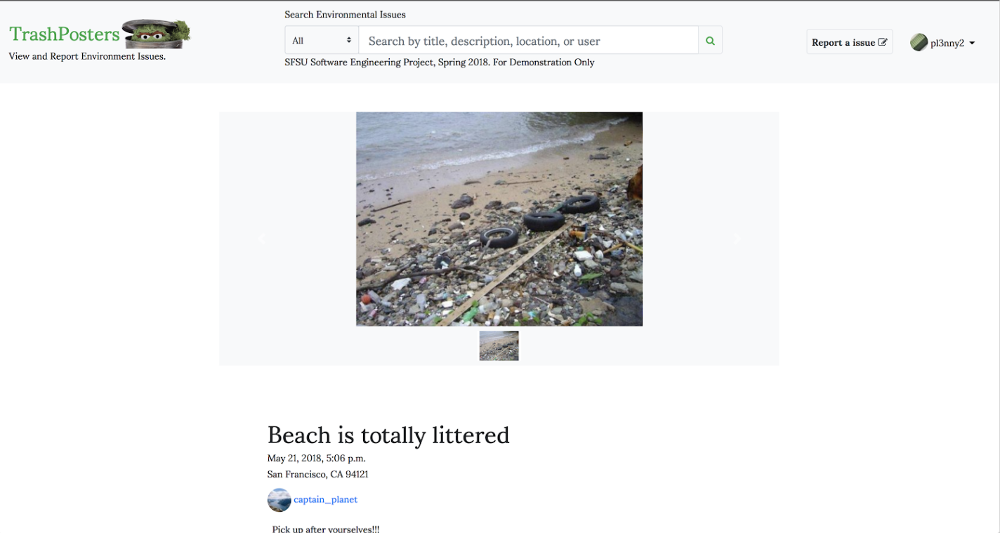

# csc648-team05

SuperHeroesInTraining

Frontend:  
Stanley - Frontend Lead  
James - Team Lead  
Tumar - Frontend  

Backend:  
Danielle - Backend Lead  
Alex - Backend  
Jianhao - Backend  

### Landing Page
  - Users can view recent posts 

### Viewing a post
  - User can click on any post and view it's contents which are
    - images(s)
    - Map / Location
    - Hazard Type

### Posting
  - If the user is registered they can post / upload an image relating to some sort of enviremental problem

### Registering User
  - If user desires to register and contribute to posting recent enviremental events they are required to fill out the fields in order to register

### Signing In
  - Once the user has registered they can no sign in and begin posting enviremental events in and around their area. 
  
